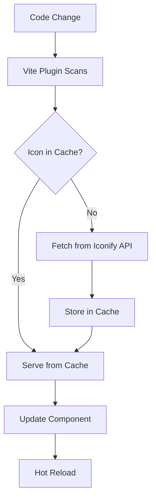
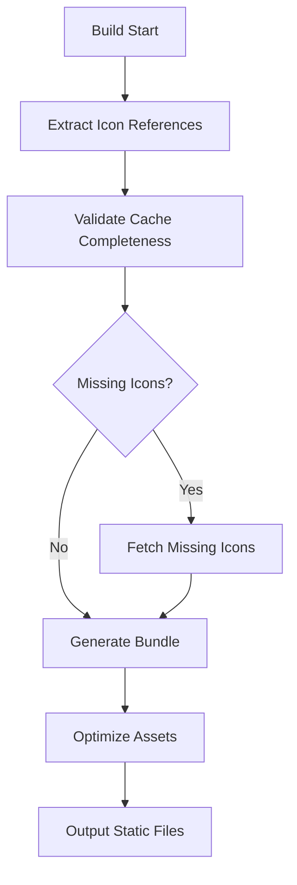

# Smart Icon Management System PRD

## Overview

A revolutionary icon management system that provides unlimited access to Iconify's 200,000+ icons without memory constraints, build-time issues, or bundle bloat. The system intelligently fetches, caches, and bundles only the icons actually used in the codebase.

## Problem Statement

### Current Issues
- **Memory Constraints**: Clean selectors cause JavaScript heap out of memory errors when adding multiple icon sets
- **Limited Icon Access**: Only installed icon packages are available, requiring manual installation for new icon sets
- **Bundle Bloat**: Pre-generating CSS for entire icon sets includes thousands of unused icons
- **Developer Friction**: Need to install packages before using icons, breaking flow when discovering new icons

### User Pain Points
- "I want to use `streamline-stickies-color:ghost-duo` but need to install the package first"
- "Build crashes when I add too many icon sets to clean selectors"
- "Bundle includes 50,000 icons but I only use 20"
- "VS Code shows the icon I want, but I can't use it without installation"

## Solution Overview

A smart icon management system that works like VS Code Iconify IntelliSense but for build-time optimization:

1. **Development**: On-demand fetching and caching of any Iconify icon
2. **Production**: Automatic bundling of only used icons
3. **Zero Configuration**: Works out of the box with any icon from any collection

## Key Features

### 1. Intelligent Development Mode
- **Auto-Discovery**: Scan code for icon references during development
- **On-Demand Fetching**: Automatically fetch SVG data from Iconify API when new icons are detected
- **Smart Caching**: Cache downloaded icons locally with intelligent cache management
- **Hot Reload Integration**: Immediate updates when icon usage changes
- **Auto-Cleanup**: Remove cached icons when no longer referenced in codebase

### 2. Optimized Production Build
- **Usage Analysis**: Extract all icon references from built application
- **Selective Bundling**: Include only icons actually used in the codebase
- **Multiple Output Formats**: SVG sprites, inlined SVGs, or optimized CSS classes
- **Bundle Splitting**: Separate critical icons from lazy-loaded icons
- **Zero Runtime Fetching**: All icons available statically in production

### 3. Enhanced Developer Experience
- **Universal Icon Access**: Use any icon from Iconify's 150+ icon sets without installation
- **IDE Integration**: Works seamlessly with VS Code Iconify IntelliSense
- **Multiple Input Formats**: Support existing and new icon specification formats
- **Error Handling**: Graceful fallbacks for missing or failed icon fetches
- **Performance Monitoring**: Track icon usage and bundle impact

## Technical Architecture

### Core Components

#### 1. Vite Plugin (`vite-plugin-smart-icons`)
```typescript
interface SmartIconsConfig {
  // Cache directory for downloaded icons
  cacheDir?: string;
  // Iconify API base URL
  apiUrl?: string;
  // Production bundling strategy
  bundleStrategy?: 'sprite' | 'inline' | 'css';
  // Auto-cleanup unused icons
  autoCleanup?: boolean;
  // Preload common icon sets
  preload?: string[];
}
```

**Responsibilities:**
- Code scanning for icon references
- API integration with Iconify
- Cache management and optimization
- Build-time bundling and optimization
- Development server integration

#### 2. Icon Component Enhancement
```typescript
interface EnhancedIconProps extends IconProps {
  // Force remote fetching (bypass cache)
  remote?: boolean;
  // Loading state customization
  loading?: React.ComponentType | string;
  // Error fallback
  fallback?: React.ComponentType | string;
  // Prefetch icon for performance
  prefetch?: boolean;
}
```

**Responsibilities:**
- Multi-format icon prop handling
- Async loading state management
- Cache-first rendering strategy
- Error boundary integration
- Performance optimization

#### 3. Cache Management System
```typescript
interface IconCache {
  // Check if icon exists in cache
  has(collection: string, name: string): boolean;
  // Get cached icon SVG
  get(collection: string, name: string): Promise<string>;
  // Store fetched icon
  set(collection: string, name: string, svg: string): Promise<void>;
  // Remove unused icons
  cleanup(usedIcons: Set<string>): Promise<void>;
  // Get cache statistics
  stats(): CacheStats;
}
```

**Features:**
- Persistent disk cache with metadata
- LRU eviction for size management
- Atomic write operations
- Cache invalidation strategies
- Performance analytics

### Data Flow

#### Development Mode


#### Production Build


## Implementation Phases

### Phase 1: Foundation (Week 1-2)
- [ ] Create Vite plugin skeleton
- [ ] Implement basic icon detection in code
- [ ] Set up Iconify API integration
- [ ] Create simple file-based cache system
- [ ] Basic error handling and logging

### Phase 2: Development Experience (Week 3-4)
- [ ] Enhanced icon component with async loading
- [ ] Hot reload integration
- [ ] Cache management UI/CLI commands
- [ ] Performance monitoring and metrics
- [ ] Comprehensive error handling

### Phase 3: Production Optimization (Week 5-6)
- [ ] Build-time icon extraction and bundling
- [ ] Multiple output format support
- [ ] Bundle optimization and splitting
- [ ] Production caching strategies
- [ ] Performance benchmarking

### Phase 4: Polish & Integration (Week 7-8)
- [ ] Documentation and examples
- [ ] VS Code extension compatibility
- [ ] TypeScript definitions and autocomplete
- [ ] Migration tools from existing approaches
- [ ] Community feedback integration

## Success Metrics

### Performance
- **Build Time**: No increase in build time compared to current approach
- **Bundle Size**: 90%+ reduction in icon-related bundle size
- **Memory Usage**: No build-time memory issues regardless of icon usage
- **Runtime Performance**: < 50ms first icon render time

### Developer Experience
- **Icon Availability**: 100% of Iconify's icon collections accessible
- **Setup Time**: Zero configuration required for basic usage
- **Error Recovery**: Graceful handling of network failures and missing icons
- **Migration Effort**: < 1 hour to migrate existing projects

### Reliability
- **Cache Hit Rate**: > 95% cache hit rate in development
- **API Reliability**: Graceful degradation when Iconify API is unavailable
- **Build Stability**: Zero build failures due to icon processing
- **Cross-Platform**: Works consistently across Windows, macOS, and Linux

## Risk Assessment

### Technical Risks
- **API Dependency**: Iconify API availability during development
  - *Mitigation*: Offline fallback mode, local icon mirrors
- **Cache Corruption**: Invalid cache states causing build issues
  - *Mitigation*: Cache validation, automatic cache repair
- **Performance Regression**: Slower development experience
  - *Mitigation*: Aggressive caching, background prefetching

### Adoption Risks
- **Migration Complexity**: Difficulty upgrading from current system
  - *Mitigation*: Backward compatibility, automated migration tools
- **Learning Curve**: New concepts for developers
  - *Mitigation*: Comprehensive documentation, gradual rollout

## Future Enhancements

### Advanced Features
- **Icon Optimization**: Automatic SVG optimization and minification
- **Custom Icon Sets**: Support for private/custom icon collections
- **Design System Integration**: Automatic icon inventory and documentation
- **A11y Enhancement**: Automatic accessibility attribute generation
- **Performance Analytics**: Detailed icon usage and performance tracking

### Ecosystem Integration
- **Storybook Plugin**: Enhanced icon documentation and testing
- **Figma Integration**: Sync icons between design and development
- **CI/CD Integration**: Icon usage reports and optimization suggestions
- **Team Collaboration**: Shared icon caches and preferences

## Conclusion

This smart icon management system represents a paradigm shift from "install everything upfront" to "fetch what you need, when you need it." By combining the unlimited access of runtime fetching with the performance benefits of build-time optimization, we can provide the best possible developer experience while maintaining optimal production performance.

The system eliminates the fundamental tension between icon availability and build performance, creating a foundation for scalable icon management that grows with the project without technical debt.